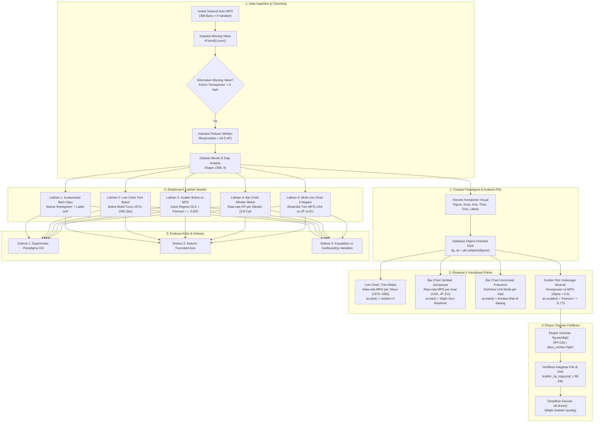

<div align="center">

# 📊 DV-05: Visualisasi Dasar dengan Matplotlib

### Mata Kuliah: Visualisasi Data | Praktikum Modul 04 / Pertemuan 05

[](https://www.python.org/)
[](https://jupyter.org/)
[](https://matplotlib.org/)
[](https://pandas.pydata.org/)
[](https://numpy.org/)
[](https://raw.githubusercontent.com/mwaskom/seaborn-data/master/mpg.csv)
[](LICENSE)

<p align="center">
  <b>Dokumentasi komprehensif, eksplorasi teori representasi grafis, bedah kode baris demi baris, dan analisis komputasional visualisasi data menggunakan Matplotlib: Dari Anatomi Plot (Figure & Axes), Paradigma Berorientasi Objek (Object-Oriented Style), Pembersihan & Imputasi Missing Value Dataset Auto MPG, Line Chart (Analisis Tren Waktu), Bar Chart Vertikal (Zero Baseline & Komparasi Kategori), Bar Chart Horizontal (Distribusi Frekuensi & Ranking), Scatter Plot & Analisis Korelasi Pearson ($r = -0.773$ & $r = -0.832$), Ekspor Gambar Resolusi Tinggi (savefig DPI 150), hingga 5 Latihan Mandiri Lanjutan & Sintesis Diskusi Kritis.</b>
</p>

---

[📌 Identitas Mahasiswa](#-identitas-mahasiswa) •
[📖 Pendahuluan & Filosofi](#-pendahuluan--filosofi-visualisasi-data--matplotlib) •
[📐 Pipeline Flowchart & Arsitektur](#-pipeline-flowchart--arsitektur-sistem) •
[📚 Penjelasan Materi & Teori](#-penjelasan-materi--teori-lengkap) •
[🛠️ Bedah 10 Langkah Praktikum](#-bedah-10-langkah-praktikum--cara-kerja-kode) •
[📝 Bedah 5 Latihan Mandiri](#-bedah-5-latihan-mandiri--analisis-mendalam) •
[💡 Pembahasan 3 Pertanyaan Diskusi](#-pembahasan-3-pertanyaan-diskusi-kritis) •
[📊 Analisis Hasil & Visualisasi](#-analisis-hasil--visualisasi) •
[🚀 Cara Menjalankan](#-cara-menjalankan-proyek) •
[📂 Struktur Direktori](#-struktur-direktori) •
[💡 Ringkasan Temuan Kunci](#-ringkasan-temuan-kunci-key-takeaways)

---

</div>

## 📌 Identitas Mahasiswa

<table align="center">
  <tr>
    <td width="240"><b>Nama Lengkap</b></td>
    <td>: <b>Gathan Hilabi</b></td>
  </tr>
  <tr>
    <td><b>Nomor Induk Mahasiswa (NIM)</b></td>
    <td>: <b>60324059</b> (Kelas A)</td>
  </tr>
  <tr>
    <td><b>Mata Kuliah</b></td>
    <td>: <b>Visualisasi Data</b></td>
  </tr>
  <tr>
    <td><b>Modul Praktikum</b></td>
    <td>: Pertemuan 05 — Visualisasi Dasar dengan Matplotlib (Tugas Praktikum 4)</td>
  </tr>
  <tr>
    <td><b>Capaian Pembelajaran (Sub-CPMK)</b></td>
    <td>: Menguasai konstruksi grafik fundamental (<i>line chart</i>, <i>bar chart</i>, <i>scatter plot</i>) menggunakan Matplotlib melalui paradigma <i>Object-Oriented</i>, hierarki anatomi plot, penanganan <i>missing value</i>, penyematan anotasi nilai, ekspor grafis beresolusi tinggi, dan penerapan prinsip integritas visual.</td>
  </tr>
  <tr>
    <td><b>Program Studi / Institusi</b></td>
    <td>: Informatika, Fakultas Sains dan Teknologi, UIN K.H. Abdurrahman Wahid Pekalongan</td>
  </tr>
  <tr>
    <td><b>Tanggal Praktikum</b></td>
    <td>: 3 Oktober 2026</td>
  </tr>
</table>

---

## 📖 Pendahuluan & Filosofi: Visualisasi Data & Matplotlib

Visualisasi data bukan sekadar kegiatan menggambar diagram estetis, melainkan sebuah disiplin rekayasa komunikasi kognitif (*cognitive amplification*). Sebagaimana dirumuskan oleh Edward Tufte dan Colin Ware, visualisasi yang efektif menerjemahkan data berdimensi tinggi menjadi pola geometris visual yang dapat diproses oleh sistem persepsi manusia dalam hitungan milidetik (*preattentive visual processing*).

```
                      SIKLUS EKSPLORASI DATA VISUAL
  [Data Mentah Tabular] ──► [Pembersihan & Imputasi] ──► [Abstraksi Visual (OO)]
           ▲                                                        │
           │                                                        ▼
  [Penalaran Kausalitas] ◄── [Deteksi Pola & Korelasi] ◄── [Rendering & Anotasi]
```

1. **Peran Fundamental Matplotlib**: Dikembangkan pertama kali oleh **John D. Hunter** pada tahun 2003 untuk memfasilitasi komputasi neurobiologi di Universitas Chicago, Matplotlib telah menjadi *lingua franca* dan pondasi bagi hampir seluruh pustaka visualisasi Python modern (seperti Seaborn, Yellowbrick, dan modul plotting bawaan Pandas).
2. **Kekuatan Paradigma Berorientasi Objek (*Object-Oriented Style*)**: Berbeda dengan antarmuka prosedural *Pyplot* yang bergantung pada status mesin global (*current figure*), paradigma Berorientasi Objek (`fig, ax = plt.subplots()`) memberikan kontrol deterministik penuh terhadap setiap kanvas (*Figure*) dan bidang koordinat (*Axes*). Hal ini menjadi standar mutlak dalam visualisasi profesional, sistem analitik produksi, dan tata letak multi-subplot.
3. **Penyajian Jujur (*Data-to-Ink Ratio* & Integritas Visual)**: Sebuah grafik harus jujur (*truthful*). Memotong sumbu nol (*truncated axis*) pada diagram batang mendistorsi rasio perbandingan kuantitas data. Mengabaikan transparansi (*alpha*) pada scatter plot menyembunyikan kepadatan data (*overplotting*). Mengabaikan satuan pengukuran menghasilkan grafik yang ambigu.
4. **Pemisahan Asosiasi Statistik dari Kausalitas**: Visualisasi bivariat (seperti korelasi kuat antara tenaga mesin dan konsumsi bahan bakar) menyajikan keterkaitan matematis, bukan bukti mekanisme sebab-akibat langsung. Analis data dituntut mengenali variabel perancu (*confounding factors*) yang bekerja di latar belakang.

Repositori ini menyajikan kajian menyeluruh dan implementasi terstruktur dari materi **Pertemuan 5 Praktikum Visualisasi Data**, mencakup 10 langkah eksplorasi dasar, 5 latihan mandiri lanjutan dengan pemodelan statistik, serta sintesis kritis terhadap 3 pertanyaan fundamental visualisasi grafis.

---

## 📐 Pipeline Flowchart & Arsitektur Sistem

Berikut adalah representasi visual diagram alir (*flowchart*) dan arsitektur teks pipeline yang memetakan seluruh siklus praktikum dari penyiapan data, eksplorasi anatomi plot, visualisasi komparatif, hingga analisis kausalitas:

### Pipeline Flowchart



### Architectural Text Pipeline

```
[RAW DATA: Auto MPG Dataset (398 Baris × 9 Fitur: MPG, Cylinders, Displacement, HP, Weight, dll.)]
   │
   ├─► [DATA AUDIT & CLEANSING] Deteksi 6 missing value pada 'horsepower'
   │        │
   │        └─► Imputasi Robust: fillna(horsepower.median() = 93.5 HP) ──► Integritas Data 100%
   │
   ├─► [CORE PARADIGM: OBJECT-ORIENTED] fig, ax = plt.subplots(figsize)
   │        │
   │        ├─► Figure: Kanvas pembungkus, resolusi (DPI), dan dimensi fisik (inches)
   │        └─► Axes  : Bidang koordinat data, ticks, grid, label sumbu, dan anotasi
   │
   ├─► [4 VISUALISASI DASAR MATPLOTLIB]
   │        │
   │        ├─► [1] Line Chart    : Tren rata-rata MPG tahun 1970-1982 (Naik dari 17.69 ke 31.71 MPG)
   │        ├─► [2] Vertical Bar  : Komparasi efisiensi asal mobil (Jepang: 30.45, Eropa: 27.89, USA: 20.08)
   │        ├─► [3] Horizontal Bar: Distribusi frekuensi sampel (USA: 249, Jepang: 79, Eropa: 70 unit)
   │        └─► [4] Scatter Plot  : Horsepower vs MPG (Alpha=0.6, Korelasi Pearson r = -0.773)
   │
   ├─► [FILE EXPORT PIPELINE] fig.savefig('scatter_hp_mpg.png', dpi=150, bbox_inches='tight')
   │        │
   │        └─► Dipanggil sebelum plt.show() untuk mencegah pengosongan kanvas memori
   │
   ├─► [5 LATIHAN MANDIRI & ANALISIS STATISTIK]
   │        │
   │        ├─► Latihan 1: Kustomisasi Barh Warna Hijau 'forestgreen' + Anotasi Nilai Teks
   │        ├─► Latihan 2: Line Chart Penurunan Rata-rata Bobot Mobil (3400 lbs ──► 2600 lbs)
   │        ├─► Latihan 3: Scatter Plot Bobot vs MPG + Regresi OLS Linear + Pearson r = -0.832
   │        ├─► Latihan 4: Bar Chart Silinder Mesin (Lonjakan Drastis HP pada Mesin 8 Silinder)
   │        └─► Latihan 5: Multi-Line Chart (Komparasi Tren Efisiensi USA vs Jepang vs Eropa)
   │
   └─► [SINTESIS KRITIS 3 PERTANYAAN DISKUSI]
            │
            ├─► Analisis 1: Keunggulan OO Style untuk Skalabilitas dan Modul Multi-Subplot
            ├─► Analisis 2: Pembuktian Matematis Distorsi Visual Akibat Pemotongan Sumbu Nol (Truncated Axis)
            └─► Analisis 3: Bedah Faktor Perancu Kausalitas (Bobot, Displacement, Teknologi Karburator)
```

---

## 📚 Penjelasan Materi & Teori Lengkap

### 1. Anatomi Hierarkis Plot Matplotlib

Matplotlib menyusun grafik dalam struktur objek bertingkat yang menyerupai pohon dokumen (*Document Object Model*):

```
+-------------------------------------------------------------------------+
| Figure (Kanvas Keseluruhan)                                             |
|                                                                         |
|    Title (Judul Grafik)                                                 |
|  +-------------------------------------------------------------------+  |
|  | Axes (Bidang Koordinat Data)                                      |  |
|  |                                                                   |  |
|Y |  Y-axis Label      * (Titik Data / Marker)                        |  |
|  |   |                |                                              |  |
|A |   |                | Line (Garis Data)                            |  |
|x |   |                |                                              |  |
|i |   +--- Major Tick  +--- Grid (Garis Kisi)                         |  |
|s |   |                                                               |  |
|  |   |                                  Legend (Keterangan Simbol)   |  |
|  |   +-----------------------------------------------------------+   |  |
|  |           |                     |                             |   |  |
|  |      Major Tick             Minor Tick                        |   |  |
|  +-------------------------------------------------------------------+  |
|             X-axis Label (Keterangan Sumbu X & Satuan)                  |
+-------------------------------------------------------------------------+
```

| Komponen | Objek Teknis | Peran dalam Visualisasi |
| :--- | :--- | :--- |
| **Figure** | `matplotlib.figure.Figure` | Bingkai kanvas terluar yang menaungi seluruh elemen grafik, judul utama, dan subplots. |
| **Axes** | `matplotlib.axes.Axes` | Bidang koordinat persegi tempat data aktual digambar. Memiliki sumbu X dan Y tersendiri. |
| **Axis** | `matplotlib.axis.Axis` | Pengatur skala numerik/kategorikal, batas nilai (*limits*), dan lokasi *ticks*. |
| **Ticks & Labels** | `Tick` & `Text` | Tanda setrip penunjuk interval nilai beserta label teks nilai pada sumbu koordinat. |
| **Spines** | `matplotlib.spines.Spine` | Garis pembatas tepi bidang Axes yang menghubungkan tanda batas koordinat. |
| **Grid** | `Line2D` | Kisi-kisi garis pandu bantu untuk mempermudah interpolasi visual pembaca. |
| **Legend** | `matplotlib.legend.Legend` | Kotak legenda yang mengasosiasikan label teks dengan warna atau bentuk marker data. |

---

### 2. Perbandingan Paradigma: Pyplot (Stateful) vs Object-Oriented (OO)

Dalam Matplotlib terdapat dua cara utama menulis kode:

```python
# CARA 1: Pyplot Style (Stateful - Berbasis Status Global)
plt.figure(figsize=(6, 4))
plt.plot(x, y)
plt.title("Grafik Pyplot")
plt.xlabel("Sumbu X")
plt.show()

# CARA 2: Object-Oriented Style (Eksplisit - Direkomendasikan)
fig, ax = plt.subplots(figsize=(6, 4))
ax.plot(x, y)
ax.set_title("Grafik Object-Oriented")
ax.set_xlabel("Sumbu X")
plt.show()
```

#### Tabel Komparasi Paradigma:

| Aspek Penilaian | Paradigma Pyplot (*Stateful*) | Paradigma Berorientasi Objek (*Object-Oriented*) |
| :--- | :--- | :--- |
| **Filosofi Desain** | Mengikuti konvensi MATLAB (memanipulasi status aktif global). | Mengikuti prinsip OOP Python murni (memegang referensi objek eksplisit). |
| **Deklarasi Kanvas** | Implisit melalui fungsi `plt.plot()`, `plt.figure()`. | Eksplisit melalui `fig, ax = plt.subplots()`. |
| **Presisi Kontrol** | Rendah; rawan salah sasaran saat mengelola beberapa grafik. | Sangat tinggi; setiap metode terikat pada instansi `ax` tertentu. |
| **Skalabilitas Multi-Panel** | Sangat rumit dan rentan bug pada tata letak grid $(N \times M)$. | Sangat mudah; array `axes[row, col]` dapat diiterasi dengan bersih. |
| **Standar Industri** | Skrip visualisasi cepat dan eksplorasi ad-hoc di konsol. | Standar emas produksi data science, dashboard, dan publikasi ilmiah. |

---

### 3. Karakteristik, Kegunaan, dan Kaidah Khusus 4 Jenis Grafik Dasar

```
1. LINE CHART          2. VERTICAL BAR        3. HORIZONTAL BAR      4. SCATTER PLOT
   Y                      Y                      Y                      Y
   │    ╭─*               │  ┌─┐                 │  ┌───────┐           │   *  *
   │  ╭─╯                 │  │ │ ┌─┐             │  ├───────┤           │  *  **
   │ *                    │  │ │ │ │ ┌─┐         │  ├───┐               │ * *  *
   └────────── X          └──┴─┴─┴─┴─┴─┴─ X      └────────── X          └────────── X
   Tren Deret Waktu       Komparasi Kategori     Ranking Label Panjang  Korelasi Bivariat
```

1. **Line Chart (`ax.plot`)**:
   - **Tujuan**: Memetakan dinamika perubahan variabel kontinu dari waktu ke waktu (*temporal dynamics*).
   - **Kaidah Teknis**: Titik data harus memiliki urutan yang bermakna (biasanya sekuensial waktu). Penambahan marker (`marker="o"`) membantu memperjelas interval observasi diskret di sepanjang garis kontinu.
2. **Bar Chart Vertikal (`ax.bar`)**:
   - **Tujuan**: Membandingkan besaran nilai kuantitatif antar kategori nominal atau ordinal yang saling lepas.
   - **Kaidah Teknis**: **Sumbu Y wajib berakar pada angka nol (Zero Baseline)**. Mengurutkan batang (*sorting*) berdasarkan nilai secara menurun (*descending*) sangat dianjurkan untuk meningkatkan efisiensi interpretasi pembaca.
3. **Bar Chart Horizontal (`ax.barh`)**:
   - **Tujuan**: Menampilkan distribusi frekuensi atau pemeringkatan (*ranking*), terutama ketika teks label kategori cukup panjang.
   - **Kaidah Teknis**: Menghindari pemutaran teks label (*rotated labels*) yang memaksa pembaca memiringkan kepala. Anotasi angka dapat disematkan di sebelah kanan ujung batang horizontal.
4. **Scatter Plot (`ax.scatter`)**:
   - **Tujuan**: Mengeksplorasi bentuk hubungan bivariat (linear, non-linear, eksponensial), mendeteksi klaster, dan mengidentifikasi pencilan (*outliers*).
   - **Kaidah Teknis**: Wajib menerapkan transparansi (`alpha \in [0.2, 0.7]`) ketika jumlah titik data padat untuk menghindari masalah penumpukan titik (*overplotting*).

---

### 4. Teori Pembersihan Data: Mengapa Median Lebih Unggul untuk Imputasi?

Pada dataset Auto MPG, variabel `horsepower` memiliki 6 data kosong (`NaN`). Dalam statistik deskriptif, imputasi nilai kosong dapat menggunakan **Mean** (Rata-rata) atau **Median** (Nilai Tengah):

$$
\text{Mean} = \bar{x} = \frac{1}{n} \sum_{i=1}^{n} x_i, \qquad \text{Median} = \tilde{x} = x_{\left(\frac{n+1}{2}\right)}
$$

- **Sensitivitas Terhadap Outlier**: Rata-rata sangat rentan terdistorsi oleh nilai ekstrim (misalnya mobil balap bertenaga $230 \text{ HP}$ akan mendongkrak rata-rata secara artifisial).
- **Karakteristik Median**: Bersifat **kekal dan kokoh (*robust statistic*)** terhadap kemencengan distribusi (*skewness*). Nilai median `horsepower` pada dataset ini adalah **93.5 HP**, yang secara akurat merepresentasikan titik tengah tipikal mobil penumpang era 1970-an.

---

### 5. Formulasi Matematis Kunci dalam Analisis Visual

#### 1. Koefisien Korelasi Pearson ($r$)

Mengukur kekuatan dan arah hubungan linear antara dua variabel kuantitatif kontinu:

$$
r_{xy} = \frac{\sum_{i=1}^{n} (x_i - \bar{x})(y_i - \bar{y})}{\sqrt{\sum_{i=1}^{n} (x_i - \bar{x})^2 \cdot \sum_{i=1}^{n} (y_i - \bar{y})^2}}
$$

- $r \in [-1, 1]$
- Nilai $r = -0.773$ (Horsepower vs MPG) dan $r = -0.832$ (Weight vs MPG) menandakan **korelasi linear negatif yang sangat kuat**.

#### 2. Regresi Linear Sederhana (*Ordinary Least Squares / OLS*)

Garis tren linear terbaik $y = mx + c$ yang meminimalkan jumlah kuadrat residu (*SSE*):

$$
m = \frac{\sum (x_i - \bar{x})(y_i - \bar{y})}{\sum (x_i - \bar{x})^2}, \qquad c = \bar{y} - m\bar{x}
$$

Dihitung secara komputasional menggunakan `np.polyfit(x, y, deg=1)`.

#### 3. Indeks Distorsi Visual Pemotongan Sumbu (*Truncated Axis Distortion*)

Tingkat perbesaran ilusi perbedaan visual ($\Delta_{\text{visual}}$ vs $\Delta_{\text{riil}}$) ketika sumbu dasar dipotong pada titik $y_0 > 0$:

$$
\text{Faktor Distorsi} = \frac{\frac{y_2 - y_0}{y_1 - y_0}}{\frac{y_2}{y_1}} = \frac{y_1(y_2 - y_0)}{y_2(y_1 - y_0)}
$$

Jika $y_1 = 26$, $y_2 = 28$, dan sumbu dipotong pada $y_0 = 25$:

$$
\text{Rasio Visual} = \frac{28 - 25}{26 - 25} = \frac{3}{1} = 3.0 \ (300\%), \qquad \text{Rasio Riil} = \frac{28}{26} \approx 1.077 \ (107.7\%)
$$

*Hasil pemotongan sumbu menciptakan ilusi perbedaan sebesar 300%, mendistorsi data riil yang sesungguhnya hanya berselisih 7.7%!*

---

## 🛠️ Bedah 10 Langkah Praktikum & Cara Kerja Kode

Berikut adalah pembedahan terperinci baris demi baris terhadap 10 langkah kerja utama pada notebook [`Praktikum4_60324059_GathanHilabi.ipynb`](Praktikum4_60324059_GathanHilabi.ipynb):

---

### 🔹 Langkah 1 — Menyiapkan Notebook dan Mengimpor Library

```python
import matplotlib
import matplotlib.pyplot as plt
import pandas as pd
import numpy as np

# Konfigurasi parameter visualisasi global Matplotlib
plt.rcParams['font.sans-serif'] = 'DejaVu Sans'
plt.rcParams['font.family'] = 'sans-serif'
plt.rcParams['figure.autolayout'] = False

print(f"Versi Matplotlib : {matplotlib.__version__}")
print(f"Versi Pandas     : {pd.__version__}")
print(f"Versi NumPy      : {np.__version__}")
```

**🔍 Analisis Teknis & Cara Kerja:**
- Mengimpor pustaka utama dengan alias standar industri: `plt` untuk Matplotlib, `pd` untuk Pandas, dan `np` untuk NumPy.
- Mengatur `plt.rcParams` untuk menetapkan tipe huruf *sans-serif* (`DejaVu Sans`) yang menjamin konsistensi rendering tipografi lintas platform sistem operasi.
- Menonaktifkan `figure.autolayout` agar penataan ruang kanvas dapat dikendalikan secara eksplisit menggunakan `bbox_inches="tight"` pada tahap penyimpanan.

---

### 🔹 Langkah 2 — Mengenal Komponen Anatomi Plot Matplotlib

```python
x_demo = [1.0, 2.0, 3.0, 4.0]
y_demo = [10.0, 25.0, 15.0, 30.0]

# 1. Deklarasi Figure dan Axes eksplisit
fig, ax = plt.subplots(figsize=(7, 4.5))

# 2. Render garis dan penanda titik
ax.plot(x_demo, y_demo, color="#2b5c8f", linewidth=2.5, marker="o", 
        markersize=8, markerfacecolor="#e74c3c", markeredgecolor="#2c3e50", 
        label="Data Sampel (Line + Marker)")

# 3. Kustomisasi elemen teks dan skala
ax.set_title("Anatomi Plot Matplotlib (Komponen Utama Sebuah Grafik)", fontsize=12, fontweight="bold", pad=12)
ax.set_xlabel("Label Sumbu X (Variabel Independen)", fontsize=10, fontweight="medium")
ax.set_ylabel("Label Sumbu Y (Nilai Terukur)", fontsize=10, fontweight="medium")

# 4. Garis bantu dan legenda
ax.grid(True, linestyle="--", alpha=0.6)
ax.legend(loc="upper left", frameon=True)

# 5. Penyematan anotasi panah
ax.annotate("Titik Data (Marker)", xy=(4.0, 30.0), xytext=(2.9, 29.0),
            arrowprops=dict(facecolor="#2c3e50", shrink=0.08, width=1.2, headwidth=6),
            fontsize=9, fontweight="semibold", color="#2c3e50")

plt.show()
```

**🔍 Analisis Teknis & Cara Kerja:**
- Mendemonstrasikan secara visual keterkaitan objek: `Figure` sebagai wadah kanvas dan `Axes` sebagai sistem koordinat.
- Parameter `markerfacecolor` dan `markeredgecolor` memisahkan pewarnaan isi dan tepi lingkaran titik observasi.
- Metode `ax.annotate()` menghubungkan teks penjelasan ke titik koordinat target `xy=(4.0, 30.0)` menggunakan panah penunjuk proporsional (`arrowprops`).

---

### 🔹 Langkah 3 — Memahami Dua Gaya Penulisan Kode Matplotlib

```python
x_data = [1, 2, 3, 4, 5]
y_data = [2, 4, 7, 11, 16]

# Menggunakan gaya Berorientasi Objek (Object-Oriented)
fig, ax = plt.subplots(figsize=(6, 3.5))
ax.plot(x_data, y_data, marker="s", color="#27ae60", linewidth=2, label="f(x)")
ax.set_title("Gaya Berorientasi Objek (fig, ax = plt.subplots())", fontsize=11, fontweight="bold")
ax.set_xlabel("Sumbu X (Eksplisit)", fontsize=10)
ax.set_ylabel("Sumbu Y (Eksplisit)", fontsize=10)
ax.grid(True, linestyle=":", alpha=0.6)
ax.legend()
plt.show()
```

**🔍 Analisis Teknis & Cara Kerja:**
- Mempraktikkan pemanggilan metode langsung pada objek `ax` (`ax.set_title`, `ax.set_xlabel`, `ax.grid`), bukan menggunakan fungsi global `plt.*`.
- Memberikan struktur kode yang modular, memudahkan isolasi konfigurasi per bidang grafik, dan mencegah konflik state grafis saat merancang visualisasi komposit.

---

### 🔹 Langkah 4 — Menyiapkan Dataset Auto MPG & Penanganan Missing Value

```python
url = "https://raw.githubusercontent.com/mwaskom/seaborn-data/master/mpg.csv"
df = pd.read_csv(url)

# Cek missing value
missing_count = df.isnull().sum()
print("Jumlah Missing Value:\n", missing_count[missing_count > 0])

# Imputasi robust menggunakan median
nilai_median_hp = df["horsepower"].median()
df["horsepower"] = df["horsepower"].fillna(nilai_median_hp)

print(f"Nilai Median Kolom 'horsepower': {nilai_median_hp}")
print(f"Missing Value setelah imputasi : {df['horsepower'].isnull().sum()}")
```

**🔍 Analisis Teknis & Cara Kerja:**
- Membaca dataset publik *Auto MPG* langsung dari URL raw GitHub Seaborn.
- Mengidentifikasi 6 data kosong pada kolom `horsepower`.
- Menerapkan teknik imputasi statistik menggunakan nilai median ($93.5\text{ HP}$) untuk mempertahankan ukuran sampel 398 baris tanpa membuang observasi berharga (*avoiding data loss*).

---

### 🔹 Langkah 5 — Eksplorasi Struktur Data & Fitur Dataset

```python
print(df[["mpg", "horsepower", "weight", "model_year", "cylinders", "origin", "name"]].head())
df.info()
print(df[["mpg", "horsepower", "weight", "model_year", "cylinders"]].describe().round(2))
```

**🔍 Analisis Variabel Kunci:**
- `mpg`: Tingkat efisiensi bahan bakar (*Miles Per Gallon*). Rata-rata $= 23.51$, rentang $= 9.0 - 46.6$.
- `horsepower`: Daya mesin kendaraan. Rata-rata $= 104.30\text{ HP}$, rentang $= 46.0 - 230.0\text{ HP}$.
- `weight`: Massa total mobil. Rata-rata $= 2970.42\text{ lbs}$, rentang $= 1613.0 - 5140.0\text{ lbs}$.
- `model_year`: Dua digit tahun perakitan ($70 = 1970$ hingga $82 = 1982$).
- `origin`: Negara manufaktur mobil (`usa` $= 249$, `japan` $= 79$, `europe` $= 70$).

---

### 🔹 Langkah 6 — Line Chart: Tren Efisiensi BBM (MPG) dari Waktu ke Waktu

```python
mpg_per_tahun = df.groupby("model_year")["mpg"].mean()

fig, ax = plt.subplots(figsize=(7, 4))
ax.plot(mpg_per_tahun.index, mpg_per_tahun.values, 
        marker="o", color="#1f77b4", linewidth=2.2, markersize=6, 
        label="Rata-rata MPG")

ax.set_title("Rata-rata Efisiensi BBM Mobil per Tahun Model", fontsize=12, fontweight="bold", pad=12)
ax.set_xlabel("Tahun Model (19xx)", fontsize=10)
ax.set_ylabel("Rata-rata MPG", fontsize=10)
ax.grid(True, linestyle="--", alpha=0.5)

# Format ticks sumbu X dengan apostrof ('70, '71, dst.)
ax.set_xticks(mpg_per_tahun.index)
ax.set_xticklabels([f"'{yr}" for yr in mpg_per_tahun.index])
plt.show()
```

**🔍 Analisis Hasil:**
- Efisiensi terendah tercatat pada tahun **1973 (17.10 MPG)**, sementara efisiensi tertinggi dicapai pada tahun **1980 (33.70 MPG)** dan **1982 (31.71 MPG)**.
- Tren peningkatan tajam pasca 1973 mencerminkan respon industri otomotif terhadap krisis embargo minyak dunia (*1973 Oil Crisis*).

---

### 🔹 Langkah 7 — Bar Chart Vertikal: Komparasi Rata-rata MPG per Negara Asal

```python
mpg_per_asal = df.groupby("origin")["mpg"].mean().sort_values(ascending=False)

fig, ax = plt.subplots(figsize=(6, 4))
bars = ax.bar(mpg_per_asal.index, mpg_per_asal.values, 
              color="steelblue", edgecolor="#1c3d5a", width=0.55)

ax.set_title("Rata-rata Efisiensi BBM Berdasarkan Asal Mobil", fontsize=12, fontweight="bold", pad=12)
ax.set_xlabel("Asal Negara (Origin)", fontsize=10)
ax.set_ylabel("Rata-rata MPG", fontsize=10)

# Sumbu Y wajib mulai dari nol!
ax.set_ylim(0, 36)
ax.grid(axis="y", linestyle="--", alpha=0.6)

# Anotasi angka rata-rata di atas setiap batang
for bar in bars:
    y_val = bar.get_height()
    ax.annotate(f"{y_val:.2f}", 
                (bar.get_x() + bar.get_width() / 2., y_val),
                ha='center', va='bottom', fontsize=9, fontweight='bold',
                xytext=(0, 3), textcoords='offset points')

plt.show()
```

**🔍 Analisis Hasil:**
- **Jepang (`japan`)**: $30.45\text{ MPG}$ (Paling hemat bahan bakar).
- **Eropa (`europe`)**: $27.89\text{ MPG}$ (Posisi menengah).
- **Amerika Serikat (`usa`)**: $20.08\text{ MPG}$ (Paling boros bahan bakar).
- Penerapan `ax.set_ylim(0, 36)` menjamin integritas perbandingan visual yang objektif.

---

### 🔹 Langkah 8 — Bar Chart Horizontal: Distribusi Sampel Mobil per Negara

```python
jumlah_mobil = df["origin"].value_counts()

fig, ax = plt.subplots(figsize=(6, 3.5))
bars_h = ax.barh(jumlah_mobil.index, jumlah_mobil.values, 
                 color="#3498db", edgecolor="#2471a3", height=0.5)

ax.set_title("Distribusi Jumlah Sampel Mobil per Asal", fontsize=12, fontweight="bold", pad=10)
ax.set_xlabel("Jumlah Mobil (Unit)", fontsize=10)
ax.set_ylabel("Asal Negara", fontsize=10)
ax.set_xlim(0, 280)
ax.grid(axis="x", linestyle="--", alpha=0.6)

# Anotasi frekuensi pada ujung batang horizontal
for bar in bars_h:
    x_val = bar.get_width()
    ax.annotate(f"{x_val} unit", 
                (x_val, bar.get_y() + bar.get_height() / 2.),
                ha='left', va='center', fontsize=9, fontweight='bold',
                xytext=(5, 0), textcoords='offset points')

plt.show()
```

**🔍 Analisis Hasil:**
- Mobil buatan Amerika Serikat mendominasi sampel ($249\text{ unit}$ atau $62.6\%$).
- Mobil Jepang berjumlah $79\text{ unit}$ ($19.8\%$) dan Eropa berjumlah $70\text{ unit}$ ($17.6\%$).
- Tata letak horizontal membuat pembacaan nama kategori bebas dari rotasi canggung.

---

### 🔹 Langkah 9 — Scatter Plot & Analisis Korelasi Horsepower vs MPG

```python
fig, ax = plt.subplots(figsize=(6.5, 4.5))
ax.scatter(df["horsepower"], df["mpg"], 
           alpha=0.6, color="#2980b9", edgecolors="none", s=45)

ax.set_title("Hubungan Tenaga Mesin (Horsepower) vs Efisiensi BBM (MPG)", fontsize=12, fontweight="bold", pad=10)
ax.set_xlabel("Horsepower (HP)", fontsize=10)
ax.set_ylabel("MPG", fontsize=10)
ax.grid(True, linestyle="--", alpha=0.5)
plt.show()

# Kalkulasi Korelasi Pearson
nilai_korelasi = df["horsepower"].corr(df["mpg"])
print(f"Koefisien Korelasi Pearson: {nilai_korelasi:.3f}")
```

**🔍 Analisis Hasil:**
- Koefisien korelasi $r = -0.773$ mengonfirmasi **hubungan linear terbalik yang kuat**: mobil dengan tenaga mesin tinggi memiliki efisiensi BBM yang rendah.
- Parameter `alpha=0.6` berhasil mengungkap konsentrasi data terpadat pada rentang $65 - 110\text{ HP}$ dan $20 - 35\text{ MPG}$.

---

### 🔹 Langkah 10 — Menyimpan Grafik ke File Gambar Profesional (`savefig`)

```python
nama_file_gambar = "scatter_hp_mpg.png"

fig, ax = plt.subplots(figsize=(6, 4))
ax.scatter(df["horsepower"], df["mpg"], alpha=0.6, color="#2c3e50")
ax.set_title("Tenaga Mesin vs Efisiensi BBM", fontsize=11, fontweight="bold")
ax.set_xlabel("Horsepower (HP)", fontsize=10)
ax.set_ylabel("MPG", fontsize=10)
ax.grid(True, linestyle=":", alpha=0.5)

# 1. Simpan gambar SEBELUM plt.show()
fig.savefig(nama_file_gambar, dpi=150, bbox_inches="tight")

# 2. Render kanvas ke layar
plt.show()
```

> [!CAUTION]
> **Aturan Urutan Eksekusi Ekspor Gambar:**  
> Metode `fig.savefig()` **wajib dieksekusi SEBELUM** `plt.show()`. Pemanggilan `plt.show()` melepaskan memori buffer grafis aktif. Jika `savefig` dipanggil belakangan, gambar yang dihasilkan akan berupa kanvas kosong berwarna putih (*blank file*).

---

## 📝 Bedah 5 Latihan Mandiri & Analisis Mendalam

Notebook praktikum memuat 5 latihan mandiri lanjutan yang menguji kemampuan sintesis analitis dan kustomisasi grafis tingkat lanjut:

---

### 🟢 Latihan 1: Kustomisasi Bar Chart Horizontal Jumlah Mobil per Asal

Membuat diagram batang horizontal dengan warna hijau (`forestgreen`), tepi gelap, label frekuensi dalam format satuan unit, dan label nama negara kapital.

```python
jumlah_asal = df["origin"].value_counts()

fig, ax = plt.subplots(figsize=(7, 3.5))
bars = ax.barh(jumlah_asal.index, jumlah_asal.values, 
               color="forestgreen", edgecolor="#145a32", height=0.55)

ax.set_title("Latihan 1: Jumlah Observasi Mobil Berdasarkan Asal Negara", fontsize=12, fontweight="bold", pad=12)
ax.set_xlabel("Jumlah Mobil (Unit)", fontsize=10)
ax.set_ylabel("Asal Negara", fontsize=10)
ax.set_xlim(0, 290)
ax.grid(axis="x", linestyle="--", alpha=0.5)

for bar in bars:
    lebar = bar.get_width()
    ax.annotate(f"{lebar} unit", 
                (lebar, bar.get_y() + bar.get_height() / 2.),
                ha='left', va='center', fontsize=9, fontweight='bold',
                xytext=(6, 0), textcoords='offset points')

ax.set_yticklabels([asal.upper() for asal in jumlah_asal.index], fontsize=10)
plt.show()
```

**📊 Hasil Analisis Latihan 1:**
- **USA**: $249\text{ unit}$ ($62.6\%$) — mendominasi basis data.
- **JAPAN**: $79\text{ unit}$ ($19.8\%$).
- **EUROPE**: $70\text{ unit}$ ($17.6\%$).

---

### 🔴 Latihan 2: Line Chart Tren Rata-rata Bobot Mobil (Weight 1970–1982)

Menganalisis pergeseran massa fisik mobil (*curb weight*) selama 12 tahun untuk membuktikan fenomena perampingan kendaraan (*vehicle downsizing*).

```python
weight_per_tahun = df.groupby("model_year")["weight"].mean()

fig, ax = plt.subplots(figsize=(7, 4))
ax.plot(weight_per_tahun.index, weight_per_tahun.values, 
        marker="s", color="#c0392b", linewidth=2.2, markersize=6, 
        label="Rata-rata Bobot (lbs)")

ax.set_title("Latihan 2: Tren Rata-rata Bobot Mobil per Tahun Model (1970 - 1982)", fontsize=12, fontweight="bold", pad=12)
ax.set_xlabel("Tahun Model (19xx)", fontsize=10)
ax.set_ylabel("Rata-rata Bobot (Pounds / lbs)", fontsize=10)
ax.grid(True, linestyle="--", alpha=0.6)
ax.legend(loc="upper right")

ax.set_xticks(weight_per_tahun.index)
ax.set_xticklabels([f"'{yr}" for yr in weight_per_tahun.index])
plt.show()
```

**📊 Hasil Analisis Latihan 2:**
- **Bobot Paling Berat**: Tahun **1973** ($3421.5\text{ lbs}$).
- **Bobot Paling Ringan**: Tahun **1982** ($2602.9\text{ lbs}$).
- **Temuan Historis**: Terjadi penurunan bobot rata-rata sebesar $\approx 818.6\text{ lbs}$ ($23.9\%$). Fenomena ini berkorelasi langsung dengan lonjakan efisiensi BBM (MPG) yang diamati pada Langkah 6.

---

### 🟣 Latihan 3: Scatter Plot Bobot Kendaraan vs MPG + Garis Regresi OLS

Memetakan hubungan bivariat antara bobot total mobil (`weight`) dengan efisiensi bahan bakar (`mpg`), dilengkapi garis tren regresi linear sederhana dan koefisien korelasi Pearson.

```python
fig, ax = plt.subplots(figsize=(6.5, 4.5))
ax.scatter(df["weight"], df["mpg"], 
           alpha=0.6, color="#8e44ad", edgecolors="none", s=40, label="Data Observasi Mobil")

# Menghitung persamaan regresi linear OLS (y = mx + c)
kemiringan, intersep = np.polyfit(df["weight"], df["mpg"], 1)
x_garis = np.linspace(df["weight"].min(), df["weight"].max(), 100)
ax.plot(x_garis, kemiringan * x_garis + intersep, 
        color="#e67e22", linewidth=2.5, linestyle="--", 
        label=f"Garis Tren (y = {kemiringan:.4f}x + {intersep:.1f})")

ax.set_title("Latihan 3: Hubungan Bobot Mobil (Weight) vs Efisiensi BBM (MPG)", fontsize=12, fontweight="bold", pad=12)
ax.set_xlabel("Bobot Mobil (Weight dalam lbs)", fontsize=10)
ax.set_ylabel("Efisiensi BBM (MPG)", fontsize=10)
ax.grid(True, linestyle=":", alpha=0.6)
ax.legend(loc="upper right")
plt.show()

korelasi_weight_mpg = df["weight"].corr(df["mpg"])
print(f"Koefisien Korelasi Pearson: {korelasi_weight_mpg:.3f}")
```

**📊 Hasil Analisis Latihan 3:**
- **Korelasi Pearson**: $r = \mathbf{-0.832}$ (Korelasi negatif **sangat kuat**).
- **Persamaan Garis Tren**: $\text{MPG} = -0.0077 \cdot \text{Weight} + 46.3$.
- **Interpretasi Fisika**: Bobot adalah determinan utama kebutuhan energi kendaraan. Setiap penambahan $1000\text{ lbs}$ bobot kendaraan mereduksi efisiensi bahan bakar sebesar $\approx 7.7\text{ MPG}$.

---

### 🟠 Latihan 4: Bar Chart Rata-rata Horsepower per Jumlah Silinder Mesin

Membandingkan output tenaga mesin rata-rata berdasarkan konfigurasi ruang bakar mesin (3, 4, 5, 6, dan 8 silinder).

```python
hp_per_cyl = df.groupby("cylinders")["horsepower"].mean().sort_index()

fig, ax = plt.subplots(figsize=(6.5, 4))
kategori_silinder = [f"{c} Silinder" for c in hp_per_cyl.index]
bars_cyl = ax.bar(kategori_silinder, hp_per_cyl.values, 
                  color="#e67e22", edgecolor="#a04000", width=0.55)

ax.set_title("Latihan 4: Rata-rata Tenaga Mesin (Horsepower) per Jumlah Silinder", fontsize=12, fontweight="bold", pad=12)
ax.set_xlabel("Konfigurasi Jumlah Silinder Mesin", fontsize=10)
ax.set_ylabel("Rata-rata Horsepower (HP)", fontsize=10)
ax.set_ylim(0, 180)
ax.grid(axis="y", linestyle="--", alpha=0.6)

for bar in bars_cyl:
    tinggi = bar.get_height()
    ax.annotate(f"{tinggi:.1f} HP", 
                (bar.get_x() + bar.get_width() / 2., tinggi),
                ha='center', va='bottom', fontsize=9, fontweight='bold',
                xytext=(0, 3), textcoords='offset points')

plt.show()
```

**📊 Hasil Analisis Latihan 4:**
- **3 Silinder**: $99.3\text{ HP}$ (Mesin putaran tinggi / Wankel Rotary).
- **4 Silinder**: $78.3\text{ HP}$ (Standar mobil ekonomis harian).
- **5 Silinder**: $82.3\text{ HP}$ (Mesin diesel Audi / Mercedes-Benz).
- **6 Silinder**: $101.5\text{ HP}$ (Sedan menengah).
- **8 Silinder**: $\mathbf{158.3\text{ HP}}$ (Mesin V8 berkapasitas besar).
- **Temuan Kunci**: Terdapat lompatan daya dua kali lipat ($+102\%$) antara mesin 4 silinder ke mesin 8 silinder, yang menjelaskan mengapa mobil 8 silinder sangat boros BBM.

---

### 🔵 Latihan 5: Multi-Line Chart Komparasi Tren MPG Tahunan Antar Negara

Menampilkan tiga kurva garis tahunan dalam satu bidang koordinat `Axes` untuk memperbandingkan evolusi efisiensi industri otomotif Jepang, Eropa, dan Amerika Serikat.

```python
tren_multi = df.groupby(["model_year", "origin"])["mpg"].mean().unstack()

fig, ax = plt.subplots(figsize=(8, 4.5))
warna_map = {"usa": "#1f77b4", "japan": "#e74c3c", "europe": "#27ae60"}
marker_map = {"usa": "o", "japan": "s", "europe": "^"}

for asal in tren_multi.columns:
    ax.plot(tren_multi.index, tren_multi[asal], 
            marker=marker_map[asal], color=warna_map[asal], 
            linewidth=2.2, markersize=6, label=f"Mobil {asal.upper()}")

ax.set_title("Latihan 5: Komparasi Tren Efisiensi BBM (MPG) Tahunan per Negara Asal", fontsize=12, fontweight="bold", pad=12)
ax.set_xlabel("Tahun Model (19xx)", fontsize=10)
ax.set_ylabel("Rata-rata MPG", fontsize=10)
ax.grid(True, linestyle="--", alpha=0.5)
ax.legend(title="Asal Produsen", loc="upper left", frameon=True)

ax.set_xticks(tren_multi.index)
ax.set_xticklabels([f"'{yr}" for yr in tren_multi.index])
plt.show()
```

**📊 Hasil Analisis Latihan 5:**
1. **Jepang (`JAPAN`)**: Memimpin efisiensi bahan bakar secara konsisten di sepanjang dekade 1970-an, mencapai puncaknya di angka $37.3\text{ MPG}$ pada tahun 1982.
2. **Eropa (`EUROPE`)**: Berada di level efisiensi menengah yang stabil dan konsisten ($24 - 31\text{ MPG}$).
3. **Amerika Serikat (`USA`)**: Memulai era 1970-an pada tingkat efisiensi terendah ($\approx 14.5\text{ MPG}$), namun mencatatkan laju percepatan perbaikan efisiensi tertinggi pasca 1977 hingga menyentuh $\approx 28\text{ MPG}$ pada tahun 1982.

---

## 💡 Pembahasan 3 Pertanyaan Diskusi Kritis

---

### ❓ Pertanyaan 1: Mengapa Pendekatan Berorientasi Objek (*Object-Oriented style*: `fig, ax = plt.subplots()`) Lebih Direkomendasikan Dibandingkan Pendekatan *Pyplot style* (`plt.plot()`), Terutama untuk Visualisasi yang Kompleks?

**Jawaban Komprehensif & Analisis Arsitektural:**

1. **Pengendalian Eksplisit Terhadap Objek Grafis (*Explicit Object Control*)**:  
   Gaya *Pyplot* mengoperasikan mesin status implisit (*state machine*). Ketika kita memanggil `plt.plot()` atau `plt.title()`, fungsi tersebut diarahkan ke kanvas dan sumbu "yang saat ini sedang aktif". Pada skrip sederhana hal ini memudahkan, namun saat mengelola beberapa grafik secara bersamaan, sangat rawan terjadi *side effects* berupa salah sasaran manipulasi elemen. Pendekatan Berorientasi Objek (*OO*) secara tegas memberikan referensi instansi objek kanvas `Figure` (`fig`) dan objek koordinat `Axes` (`ax`). Setiap properti visual dipanggil melalui metode eksplisit pada objek target (`ax.set_xlabel()`, `ax.grid()`).
2. **Skalabilitas Grid Multi-Subplot (*Subplot Scalability*)**:  
   Pada skenario dashboard atau visualisasi multi-panel (seperti grid $2 \times 2$ atau $1 \times 3$), sintaks `fig, axes = plt.subplots(nrows, ncols)` mengembalikan array NumPy berisi objek `Axes`. Kita dapat memanipulasi masing-masing subplot menggunakan indeks matriks reguler (`axes[0, 1]`) atau melakukan perulangan (*looping*) secara elegan dan terstruktur.
3. **Standar Industri dan Keterpeliharaan Kode (*Maintainability*)**:  
   Dokumentasi resmi Matplotlib serta komunitas sains data menetapkan gaya OO sebagai praktik terbaik (*best practice*). Kode bergaya OO memisahkan tanggung jawab antara *kontainer kanvas* (`Figure`) dan *wilayah rendering data* (`Axes`), menjadikannya sangat mudah diintegrasikan ke dalam fungsi, modul aplikasi GUI, atau pipeline web berbasis web (misalnya Flask/Django/FastAPI).

---

### ❓ Pertanyaan 2: Mengapa pada Bar Chart Sumbu Nilai (Umumnya Sumbu Y) **Wajib Dimulai dari Angka 0 (Nol)**, dan Apa Dampak Visual/Interpretasi yang Terjadi Jika Sumbu Tersebut Dipotong (*Truncated Axis*)?

**Jawaban Komprehensif & Analisis Kognitif:**

1. **Prinsip *Encoding* Panjang Batang (*Visual Encoding via Bar Height*)**:  
   Persepsi kognitif mata manusia memproses kuantitas pada diagram batang melalui **rasio panjang atau tinggi fisik batang**, yang berakar dari garis dasar (*baseline*). Otak kita secara otomatis memperlakukan tinggi batang sebagai representasi proporsional mutlak dari besaran data.
2. **Terjadinya Distorsi Ilusi Visual (*Visual Distortion Factor*)**:  
   Ketika sumbu nilai dipotong (*truncated axis*), misalnya dimulai dari angka 25 bukan 0:
   - Nilai Kategori A $= 26$ menghasilkan tinggi batang visual $= 26 - 25 = 1$ satuan.
   - Nilai Kategori B $= 28$ menghasilkan tinggi batang visual $= 28 - 25 = 3$ satuan.
   - **Dampak Kognitif**: Batang B secara visual tampak **300% (tiga kali lipat) lebih tinggi** daripada batang A, padahal selisih nilai riil data hanya sebesar **7.7%** ($28/26$). Ini adalah bentuk manipulasi visual yang sangat menyesatkan audiens (*misleading data visualization*).
3. **Perbedaan Fundamental dengan Line Chart dan Scatter Plot**:  
   Pada **Line Chart** dan **Scatter Plot**, *zero baseline* **tidak wajib**. Kedua grafik tersebut meng-encode informasi melalui **posisi titik koordinat** (*position along a common scale*), bukan luas atau tinggi bentuk geometri batang. Pemotongan sumbu pada line chart justru diperbolehkan untuk menonjolkan dinamika fluktuasi lokal tanpa mengurangi kejujuran data.

---

### ❓ Pertanyaan 3: Dalam Analisis Scatter Plot Antara *Horsepower* dan *MPG* Ditemukan Korelasi Negatif Kuat ($r \approx -0.773$). Mengapa Prinsip *"Korelasi Tidak Sama dengan Sebab-Akibat"* (*Correlation Does Not Imply Causation*) Sangat Ditekankan, dan Faktor Laten Apa yang Sebenarnya Mempengaruhi Kedua Variabel Tersebut?

**Jawaban Komprehensif & Analisis Multivariat:**

1. **Batasan Matematika Korelasi**:  
   Koefisien korelasi Pearson $r = -0.773$ membuktikan adanya **kovariansi terbalik secara statistik**: mobil dengan horsepower tinggi memiliki kecenderungan empiris efisiensi MPG rendah. Namun, nilai korelasi matematis tidak dapat mengisolasi apakah $X$ menyebabkan $Y$, atau $Y$ menyebabkan $X$, atau keduanya dikendalikan oleh faktor ketiga.
2. **Identifikasi Variabel Perancu (*Confounding / Latent Variables*)**:  
   Dalam rekayasa otomotif tahun 1970-an, terdapat faktor laten mendasar yang memengaruhi kedua variabel secara bersamaan:
   - **Bobot Kendaraan (*Vehicle Mass / Weight*)**: Mobil bertenaga besar dibangun di atas sasis dan rangka yang sangat berat ($r$ antara Horsepower dan Weight $= +0.864$). Menurut hukum kedua Newton ($F = ma$), memindahkan massa yang lebih besar membutuhkan kerja mekanis dan energi bahan bakar yang jauh lebih masif.
   - **Kapasitas Ruang Bakar (*Displacement*) & Jumlah Silinder**: Mesin bertenaga tinggi era tersebut mengandalkan blok mesin besar (V8 dengan kapasitas hingga $400\text{ cu. in.}$), yang secara inheren mengonsumsi volume campuran udara-bensin yang besar pada setiap siklus pembakaran.
   - **Teknologi Pembakaran Konvensional**: Pada dekade 1970-an, sistem pengabutan bahan bakar masih didominasi oleh karburator mekanis berukuran besar tanpa sistem kendali injeksi elektronik (*EFI*) dan sensor oksigen komputerisasi seperti mobil modern.
3. **Kesimpulan Analitik**:  
   Menyimpulkan bahwa "menurunkan tenaga mesin saja pasti langsung membuat mobil menjadi irit" adalah sesat pikir kausalitas (*causation fallacy*). Jika sebuah mobil bermassa 2 ton dipasangi mesin kecil bertenaga rendah, mesin tersebut akan bekerja pada beban maksimum terus-menerus dan tetap mengonsumsi bahan bakar dalam jumlah besar.

---

## 📊 Analisis Hasil & Visualisasi

Berikut adalah ringkasan temuan kuantitatif utama dari hasil eksekusi kode notebook:

### 1. Tabel Ringkasan Metrik Analitik Dataset Auto MPG

| Kategori Analisis | Metrik / Variabel | Nilai Kunci | Makna Analitik |
| :--- | :--- | :---: | :--- |
| **Pembersihan Data** | Imputasi Missing Value | $93.5\text{ HP}$ (Median) | Menjaga stabilitas distribusi daya mesin |
| **Tren Temporal Line** | Rentang Rata-rata MPG | $17.10 \longrightarrow 31.71$ | Efisiensi melonjak $+85.4\%$ pasca krisis energi |
| **Tren Bobot Line** | Rentang Bobot Rata-rata | $3421.5 \longrightarrow 2602.9\text{ lbs}$ | Perampingan fisik kendaraan sebesar $-23.9\%$ |
| **Komparasi Negara** | Rata-rata Efisiensi Asal | Jepang ($30.45$) > Eropa ($27.89$) > USA ($20.08$) | Industri Asia unggul dalam arsitektur mobil kompak |
| **Distribusi Sampel** | Proporsi Asal Mobil | USA ($62.6\%$), Jepang ($19.8\%$), Eropa ($17.6\%$) | Representasi pasar mobil Amerika Serikat tahun 70-an |
| **Korelasi Bivariat 1** | Horsepower vs MPG | $r = \mathbf{-0.773}$ | Hubungan terbalik kuat antara daya dan efisiensi |
| **Korelasi Bivariat 2** | Weight vs MPG | $r = \mathbf{-0.832}$ | Bobot adalah determinan negatif terbesar bagi efisiensi |
| **Karakter Silinder** | Output Daya Mesin | 4 Silinder ($78.3\text{ HP}$) vs 8 Silinder ($158.3\text{ HP}$) | Lompatan daya $+102\%$ pada konfigurasi V8 |

---

### 2. Ilustrasi Visual Tren Kunci

```
1. DINAMIKA EFISIENSI BBM TAHUNAN (MPG)          2. HUBUNGAN BOBOT MOBIL VS EFISIENSI BBM
MPG                                              MPG
35 ┼                       ╭──* (1980: 33.7)     45 ┼ *
   │                     ╭─╯                     40 ┼   * * 
30 ┼                    *      * (1982: 31.7)    35 ┼     * *   (r = -0.832)
   │               ╭───╯                         30 ┼       * * *
25 ┼          ╭───*                              25 ┼         * * * * 
   │        ╭─╯                                  20 ┼           * * * * *
20 ┼    ╭───* (1975)                             15 ┼             * * * * *
   │  ╭─╯                                        10 ┼               * * * *
15 ┼ ─* (1973: 17.1 - Krisis Energi)              5 ┼──────────────────────────────
   └──────────────────────────────────── Tahun      └────────────────────────────── Weight
     '70  '72  '74  '76  '78  '80  '82              1500  2500  3500  4500  5500 (lbs)
```

---

## 🚀 Cara Menjalankan Proyek

Ikuti langkah-langkah di bawah ini untuk menjalankan kode notebook pada lingkungan lokal Anda:

### 1. Kloning Repositori Git

```bash
git clone https://github.com/G-than12/DV-05-MATPLOTLIB.git
cd DV-05-MATPLOTLIB
```

### 2. Buat dan Aktifkan Virtual Environment (Disarankan)

```bash
# Pengguna Windows (PowerShell / Command Prompt)
python -m venv venv
venv\Scripts\activate

# Pengguna macOS / Linux
python3 -m venv venv
source venv/bin/activate
```

### 3. Instalasi Dependensi Pustaka

```bash
pip install matplotlib pandas numpy jupyter
```

### 4. Eksekusi Jupyter Notebook

```bash
jupyter notebook Praktikum4_60324059_GathanHilabi.ipynb
```

*Notebook juga dapat dibuka secara langsung menggunakan ekstensi Jupyter pada Visual Studio Code atau diunggah ke Google Colaboratory.*

---

## 📂 Struktur Direktori

```plaintext
DV-05-MATPLOTLIB/
│
├── .gitignore                               # Berkas konfigurasi berkas tersembunyi / build cache Git
├── Praktikum4_60324059_GathanHilabi.ipynb   # Notebook utama praktikum (10 Langkah, 5 Latihan, 3 Diskusi)
├── scatter_hp_mpg.png                       # Gambar ekspor resolusi tinggi (Langkah 10, DPI 150)
└── README.md                                # Dokumentasi komprehensif, teori, bedah kode & analisis
```

---

## 💡 Ringkasan Temuan Kunci (*Key Takeaways*)

1. **Objek Eksplisit Menjamin Keandalan Kode**: Paradigma *Object-Oriented* (`fig, ax = plt.subplots()`) memberikan isolasi konteks yang presisi, mencegah bug status global, dan merupakan standar wajib visualisasi ilmiah modern.
2. **Kaidah Zero Baseline Mutlak pada Bar Chart**: Diagram batang menggunakan dimensi tinggi fisik sebagai enkoding nilai. Pemotongan sumbu nol (*truncated axis*) menciptakan ilusi optik yang mendistorsi perbedaan data secara dramatis.
3. **Data Bersih Menjamin Integritas Visual**: Imputasi missing value menggunakan nilai **median** melindungi model dan grafik dari distorsi pencilan (*outliers*), menjamin kebenaran agregasi statistik.
4. **Bobot Kendaraan Adalah Determinan Utama Efisiensi**: Melalui korelasi $r = -0.832$ dan garis regresi linear OLS, terbukti bahwa penurunan bobot kendaraan sebesar $23.9\%$ pasca krisis energi 1973 menjadi faktor pendorong utama lonjakan efisiensi bahan bakar di era 1980-an.
5. **Korelasi Bukan Bukti Kausalitas Tunggal**: Korelasi kuat antara tenaga mesin dan konsumsi bahan bakar dipengaruhi oleh variabel perancu sistemik (bobot sasis, volume ruang bakar, dan teknologi karburator konvensional).
6. **Prosedur Ekspor Grafis Profesional**: Pemanggilan `fig.savefig()` dengan konfigurasi resolusi tajam (`dpi=150`) dan `bbox_inches="tight"` wajib dilakukan sebelum `plt.show()` untuk menghindari pengosongan buffer memori kanvas.

---

## 📄 Lisensi

Proyek praktikum ini didistribusikan di bawah lisensi terbuka **MIT License** — bebas digunakan untuk kepentingan studi akademik, riset mahasiswa, dan pembelajaran visualisasi data.

<div align="center">
  <sub>Praktikum Visualisasi Data • Pertemuan 05 (Modul 04) • Tahun Akademik 2026</sub><br>
  <sub>Dibuat dengan dedikasi akademik oleh: <b>Gathan Hilabi</b> (NIM: 60324059)</sub>
</div>
